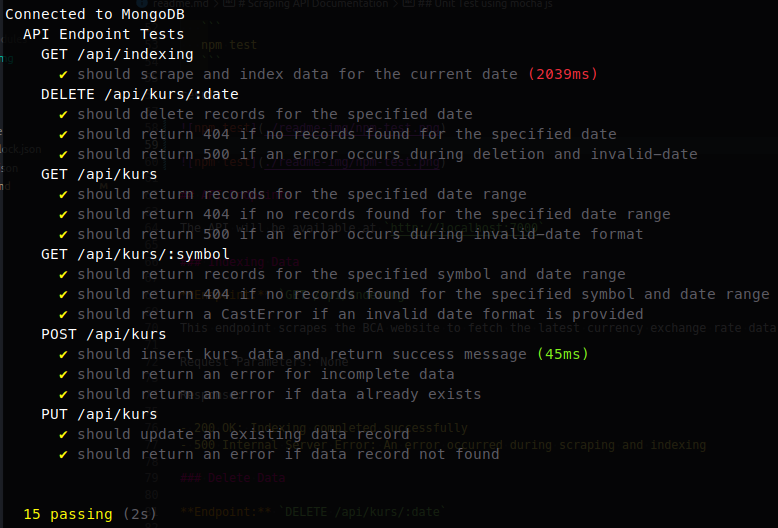

# Scraping API Documentation

## Postman Documentation


## Introduction

The Currency Exchange API provides access to currency exchange rate data sourced from the BCA website. It allows users to index and retrieve exchange rate information based on specific dates, symbols, and date ranges.

## Installation

To set up the Currency Exchange API on your local machine, follow these steps:

1. Clone the repository:

   ```
   git clone https://github.com/adityaoryza/scraping-api.git
   ```

2. Install dependencies:

   ```
   cd scraping-api
   npm install
   ```

3. Start the server:

   ```
   npm start
   ```

## Unit Test using mocha js

To start the unit test, follow these steps:

1. Start the Unit Test (mochajs):

   ```
   npm test
   ```

result :




## API Endpoints

The API will be available at `http://localhost:7000`.

### Indexing Data

**Endpoint:** `GET /api/indexing`

This endpoint scrapes the BCA website to fetch the latest currency exchange rate data and indexes it in the database.

Request Parameters: None

Response:

- 200 OK: Indexing completed successfully
- 500 Internal Server Error: An error occurred during scraping and indexing

### Delete Data

**Endpoint:** `DELETE /api/kurs/:date`

This endpoint deletes currency exchange rate data for a specific date.

Request Parameters:

- `date` (string): The date in the format "YYYY-MM-DD" (e.g., "2023-05-31")

Response:

- 200 OK: Records for the specified date were deleted successfully
- 404 Not Found: No records found for the specified date
- 500 Internal Server Error: Failed to delete records

### Get Data by Date Range

**Endpoint:** `GET /api/kurs`

This endpoint retrieves currency exchange rate data within a specified date range.

Request Parameters:

- `startdate` (string): The start date of the range in the format "YYYY-MM-DD"
- `enddate` (string): The end date of the range in the format "YYYY-MM-DD"

Response:

- 200 OK: Array of records within the specified date range
- 404 Not Found: No records found for the specified date range
- 500 Internal Server Error: Failed to fetch records or invalid date format

### Get Data by Symbol and Date Range

**Endpoint:** `GET /api/kurs/:symbol`

This endpoint retrieves currency exchange rate data for a specific symbol within a specified date range.

Request Parameters:

- `symbol` (string): The currency symbol (e.g., "USD", "EUR")
- `startdate` (string): The start date of the range in the format "YYYY-MM-DD"
- `enddate` (string): The end date of the range in the format "YYYY-MM-DD"

Response:

- 200 OK: Array of records for the specified symbol and date range
- 404 Not Found: No records found for the specified symbol and date range
- 500 Internal Server Error: Failed to fetch records or invalid date format

### Insert Data

\*\*

Endpoint:\*\* `POST /api/kurs`

This endpoint inserts new currency exchange rate data into the database.

Request Body:

- `symbol` (string): The currency symbol
- `e_rate.jual` (number): Selling exchange rate
- `e_rate.beli` (number): Buying exchange rate
- `tt_counter.jual` (number): Selling exchange rate for traveler's checks
- `tt_counter.beli` (number): Buying exchange rate for traveler's checks
- `bank_notes.jual` (number): Selling exchange rate for bank notes
- `bank_notes.beli` (number): Buying exchange rate for bank notes
- `date` (string): The date of the exchange rate data in the format "YYYY-MM-DD"

Response:

- 201 Created: New record created successfully
- 400 Bad Request: Invalid request body
- 500 Internal Server Error: Failed to create new record

### Update Data

**Endpoint:** `PUT /api/kurs/:id`

This endpoint updates existing currency exchange rate data.

Request Parameters:

- `id` (string): The ID of the record to update

Request Body: Same as the request body for inserting data

Response:

- 200 OK: Record updated successfully
- 400 Bad Request: Invalid request body or record not found
- 500 Internal Server Error: Failed to update record

## Data Model

The data model for currency exchange rate records consists of the following fields:

- `symbol` (string): The currency symbol
- `e_rate.jual` (number): Selling exchange rate
- `e_rate.beli` (number): Buying exchange rate
- `tt_counter.jual` (number): Selling exchange rate for traveler's checks
- `tt_counter.beli` (number): Buying exchange rate for traveler's checks
- `bank_notes.jual` (number): Selling exchange rate for bank notes
- `bank_notes.beli` (number): Buying exchange rate for bank notes
- `date` (date): The date of the exchange rate data

The `symbol` field represents the currency symbol, and the other fields represent different types of exchange rates. The `date` field stores the date for which the exchange rate data is applicable.
